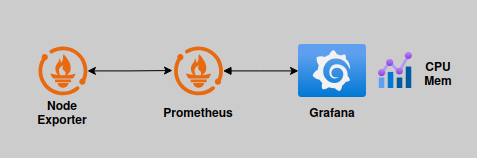
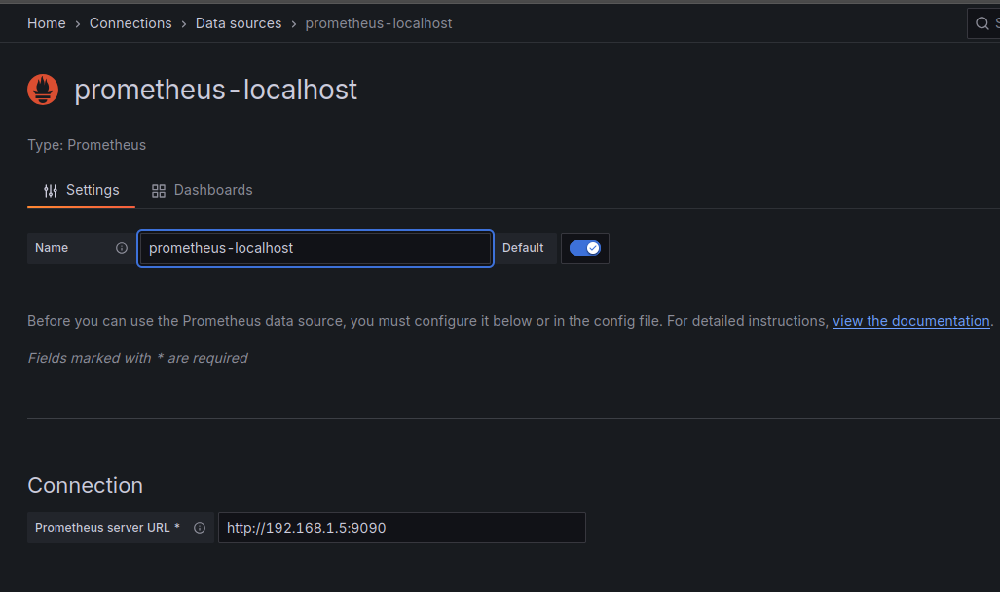
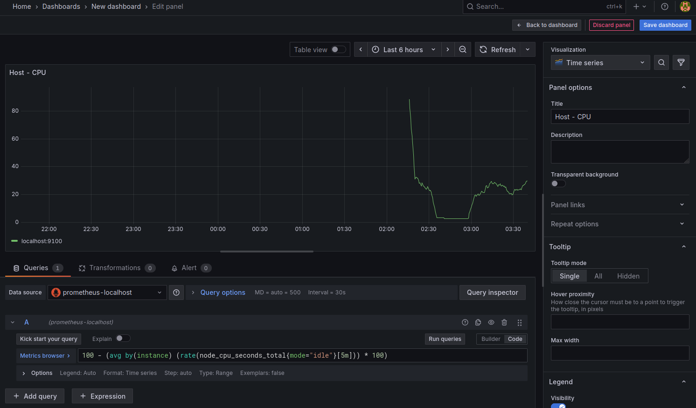
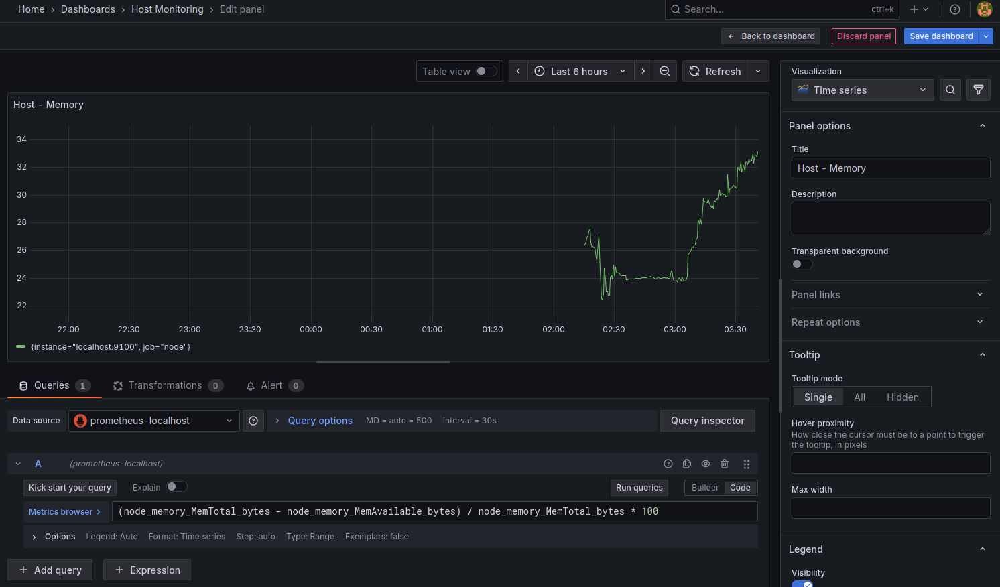
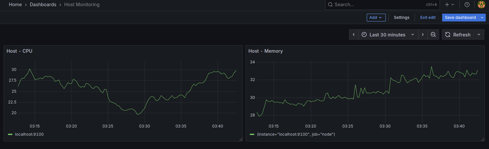

# Setup CPU & Memory monitoring using Node Exporter - Prometheus - Grafana



## Install and run Node Exporter
* `wget https://github.com/prometheus/node_exporter/releases/download/v1.9.1/node_exporter-1.9.1.linux-amd64.tar.gz`
* `tar xzvf node_exporter-1.9.1.linux-amd64.tar.gz`
* `cd node_exporter-1.9.1.linux-amd64`
* `./node_exporter`

## (Optional) Configure Node Exporter as a service
* `sudo vim /etc/systemd/system/node_exporter.service`
```
[Unit]
Description=Node Exporter
Wants=network-online.target
After=network-online.target

[Service]
User=root
Group=root
Type=simple
ExecStart=/etc/node_exporter/node_exporter --collector.systemd

[Install]
WantedBy=multi-user.target
```

* `sudo systemctl daemon-reload`
* `sudo systemctl start node_exporter`
* `systemctl enable node_exporter`

## Access Node Exporter
http://localhost:9100/

## Install and run Prometheus
* `wget https://github.com/prometheus/node_exporter/releases/download/v1.9.1/node_exporter-1.9.1.linux-amd64.tar.gz`
* `tar xzvf  prometheus-3.5.0.linux-amd64.tar.gz`
* `cd  prometheus-3.5.0.linux-amd64`

## Configure prometheus.yml
 ```
global:
  scrape_interval: 15s

scrape_configs:
- job_name: node
  static_configs:
  - targets: ['localhost:9100']
 ```

## Run Prometheus
* `./prometheus --config.file=./prometheus.yml`

## (Optional) Configure Node Exporter as a service
* `sudo vim /etc/systemd/system/prometheus.service`
```
[Unit]
Description=Prometheus
Wants=network-online.target
After=network-online.target

[Service]
User=root
Group=root
Type=simple
ExecStart=/etc/prometheus/prometheus --config.file=/etc/prometheus/prometheus.yml

[Install]
WantedBy=multi-user.target
```

* `sudo systemctl daemon-reload`
* `sudo systemctl start prometheus`
* `systemctl enable prometheus`

## Access Prometheus
http://localhost:9090/graph


## Query CPU data
```
rate(node_cpu_seconds_total{mode="system"}[1m])
100 - (avg by(instance) (rate(node_cpu_seconds_total{mode="idle"}[5m])) * 100)
```

## Query CPU data
```
(node_memory_MemTotalterraform_docker/nginx.tf_bytes - node_memory_MemAvailable_bytes) / node_memory_MemTotal_bytes * 100
```

--------------------------------------------------------------------------------------------
## Install Grafana
* `docker run -d --name=grafana -p 3000:3000 grafana/grafana-enterprise`
or 
* `docker run -d --name=grafana -p 3000:3000 grafana/grafana-oss`

## Create a Docker volume
* `docker volume create grafana-storage`

## Run the Grafana container with the volume mounted
* `docker run -d -p 3000:3000 --name grafana-instance -v grafana-storage:/var/lib/grafana grafana/grafana`

## Access Grafana (default user / password = admin / admin)
http://localhost:3000

## Setup Prometheus Data Source on Grafana
## for mac / windows
http://host.docker.internal:9090

## for linux (get host IP Address)
ip a | grep inet 
http://192.168.1.5:9090






